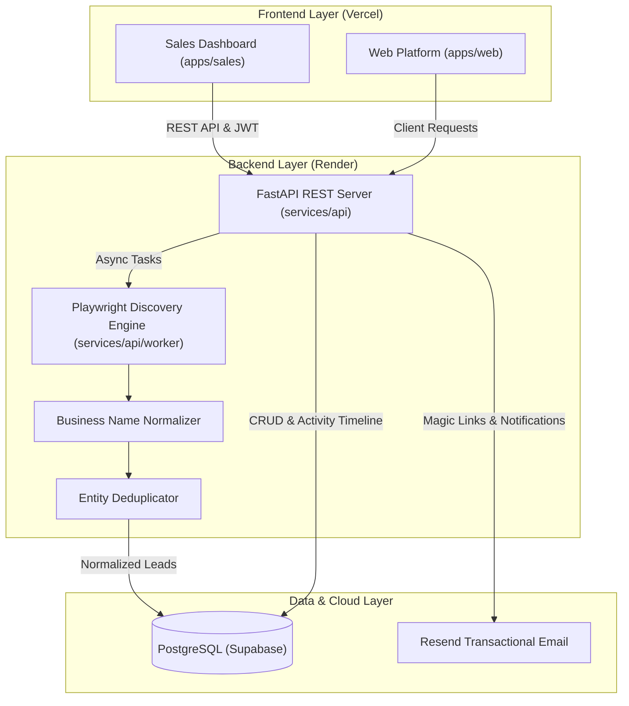

<div align="center">

# FastUI Platform

**Next-Generation Sales Discovery, Lead Intelligence, and Autonomous CRM Monorepo**

[](https://github.com/mrharshraval/fastui/actions)
[](https://nextjs.org/)
[](https://fastapi.tiangolo.com/)
[](https://turbo.build/)
[](https://supabase.com/)
[](LICENSE)

</div>

---

## 📖 Overview

**FastUI** is a modern, full-stack B2B sales discovery and prospecting platform designed to find businesses without websites, extract high-intent contact details via headless browser automation, normalize and deduplicate records, and accelerate outreach pipelines through a minimal, Apple-styled dashboard.

---

## 🏛️ System Architecture



---

## 📂 Repository Structure

```text
fastui/
├── .github/
│   └── workflows/ci.yml      # Automated GitHub Actions CI/CD Pipeline
├── apps/
│   ├── sales/                # Main Next.js 16 Sales Prospecting CRM
│   └── web/                  # Landing page & visual experiences
├── packages/                 # Shared UI & utility packages
├── services/
│   └── api/                  # Production FastAPI backend
│       ├── core/             # Dynamic configuration, JWT auth, exceptions
│       ├── models/           # SQLAlchemy schema & Alembic migrations
│       ├── routes/           # REST endpoints (auth, prospecting, leads, stats)
│       ├── services/         # Business logic (auth, discovery, analytics)
│       └── worker/           # Scraper engine, Playwright adapters & deduplication
├── turbo.json                # Turborepo orchestration
├── pnpm-workspace.yaml       # pnpm monorepo workspace definition
└── README.md                 # Project documentation
```

---

## 🚀 Quickstart & Local Development

### Prerequisites
* **Node.js**: `v20+` & **pnpm**: `v9+`
* **Python**: `3.11+`
* **PostgreSQL** database (Local or Supabase)

### 1. Clone & Install Dependencies

```bash
# Clone the repository
git clone https://github.com/mrharshraval/fastui.git
cd fastui

# Install frontend monorepo dependencies
pnpm install
```

### 2. Configure Environment Variables

Create `.env` inside `services/api/`:

```ini
ENVIRONMENT=development
DEBUG=true
DATABASE_URL=sqlite+aiosqlite:///./fastui_sales.db
JWT_SECRET_KEY=super-secret-local-dev-key-replace-in-prod
FRONTEND_URL=http://localhost:3000
CORS_ALLOWED_ORIGINS=http://localhost:3000
EMAIL_PROVIDER=mock
```

Create `.env.local` inside `apps/sales/`:

```ini
NEXT_PUBLIC_API_URL=http://localhost:8000
```

### 3. Start Backend & Workers

```bash
cd services/api

# Create & activate Python virtual environment
python -m venv venv
# Windows:
venv\Scripts\activate
# Linux/macOS:
source venv/bin/activate

# Install dependencies & Playwright browser binaries
pip install -r requirements.txt
playwright install chromium

# Run database migrations
alembic upgrade head

# Start FastAPI dev server
uvicorn main:app --reload --port 8000
```

### 4. Start Frontend Applications

In a new terminal at the repository root:

```bash
# Run Next.js Sales CRM
pnpm --filter sales dev
```

Open [http://localhost:3000](http://localhost:3000) to view the application.

---

## 🧪 Testing & Verification

Run backend unit & integration tests:

```bash
cd services/api
python -m pytest tests -v
```

Run frontend typechecking and production build:

```bash
pnpm build
```

---

## ☁️ Production Deployment

### 1. Backend on Render (Web Service)
* **Root Directory**: `services/api`
* **Build Command**: `pip install -r requirements.txt && playwright install chromium --with-deps && alembic upgrade head`
* **Start Command**: `uvicorn main:app --host 0.0.0.0 --port $PORT`

### 2. Frontend on Vercel
* **Framework Preset**: Next.js
* **Root Directory**: `apps/sales`
* **Environment Variable**: `NEXT_PUBLIC_API_URL=https://your-api.onrender.com`

---

## 🤝 Contributing

Please read [CONTRIBUTING.md](CONTRIBUTING.md) for details on our code of conduct, branching model, and the process for submitting pull requests.

---

## 📄 License

This project is licensed under the MIT License - see the [LICENSE](LICENSE) file for details.
